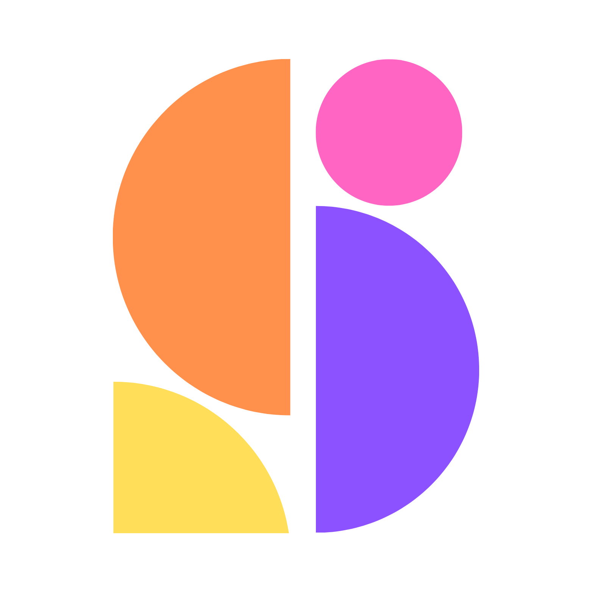

<div align="center">



# Schedulala

### Your agent posts. Replies. Measures. Listens.

**12 Platforms. Any Agent. One Prompt.**

[](https://www.npmjs.com/package/schedulala)
[](https://www.npmjs.com/package/@schedulala/mcp-server)
[](LICENSE)
[](https://registry.modelcontextprotocol.io/v0/servers?search=schedulala)
[](https://x.com/schedulala)

</div>

---

Schedulala teaches any AI agent to run your social media end to end: schedule
and publish to **12 platforms** — Twitter/X, Instagram, TikTok, LinkedIn,
YouTube, Facebook, Threads, Bluesky, Pinterest, Mastodon, Telegram, and Google
Business Profile — with **first comments on 8 of them through one API field**,
every post **validated against each platform's character limits and media
rules before anything publishes**, plus analytics, comment triage, and keyword
listening from the same conversation. The skill was tested against genuinely
cold agents until one installed, connected, and posted with zero human help.

## Quick start

Works with OpenClaw, Hermes, Claude Code, Cursor, Codex, claude.ai, ChatGPT,
and anything with a shell. Per-runtime guides: [schedulala.com/agents](https://schedulala.com/agents).

**CLI · MCP (remote or stdio) · sandbox keys that never publish**

Get your API key from [schedulala.com](https://schedulala.com/dashboard?view=developer), then send this message to your agent:

> Read https://schedulala.com/SKILL.md and follow it to set up Schedulala.
> My API key is sk_live_·········

That's the whole install. The hosted skill walks your agent through the CLI
(`npm i -g schedulala`, zero tool-schema tokens), or MCP if you prefer typed
tools — and teaches the safe workflow: draft → validate/preview → confirm →
publish → verify, plus the per-platform rules that reject posts (TikTok
privacy + postMode, Instagram media, YouTube titles, character limits, …).

No key yet? A free one takes two minutes (`npx schedulala init --email
you@example.com`) and includes 2 connected accounts and 4 posts to try the
loop. `sk_test_` keys simulate everything without publishing.

## The hosted connector (claude.ai / Claude Desktop / ChatGPT)

No install at all — interactive widgets included (post previews, in-chat
media upload, analytics cards, calendar, inbox). In Claude:
**Settings → Connectors → Add custom connector** and paste:

```
https://schedulala.com/api/mcp
```

OAuth sign-in, no API key handling. Requires a paid Claude plan for custom
connectors; the same URL works in ChatGPT.
Setup guide: https://schedulala.com/developers/docs/claude-connector

<p align="center">
  
  &nbsp;&nbsp;
  
</p>
<p align="center">
  <em>Set up in two minutes — then post everywhere from one chat.</em><br />
  <a href="https://schedulala.com/videos/mcp-launch-45s.mp4">Full 45s demo (sound on)</a> ·
  <a href="https://schedulala.com/videos/connect-claude.mp4">Setup</a> ·
  <a href="https://schedulala.com/videos/posting-restaurant.mp4">Posting</a> ·
  <a href="https://schedulala.com/videos/comments-restaurant.mp4">Comments</a> ·
  <a href="https://schedulala.com/videos/bulk-restaurant.mp4">Bulk</a> ·
  <a href="https://schedulala.com/videos/besttimes-restaurant.mp4">Best times</a> ·
  <a href="https://schedulala.com/videos/analytics-restaurant.mp4">Analytics</a>
</p>

## Install the skill locally (optional)

The one-liner above needs no install. If your runtime prefers a local skill:

```bash
# skills CLI
npx skills add schedulala/schedulala-agent

# Claude Code plugin marketplace
/plugin marketplace add schedulala/schedulala-agent

# OpenClaw (ClawHub)
openclaw skills install schedulala

# plain git
git clone https://github.com/schedulala/schedulala-agent ~/.claude/skills/schedulala-agent
```

Pair it with either:

- the **local MCP server** — `npx -y @schedulala/mcp-server` with
  `SCHEDULALA_API_KEY` (Claude Desktop / Claude Code / Cursor config in the
  [package README](https://www.npmjs.com/package/@schedulala/mcp-server)), or
- the **CLI** — `npx schedulala init --email you@example.com`, then
  `npx schedulala post "Hello" --platforms twitter --now`. Every command
  supports `--json`; exit codes 0–7.

## What's in this repo

```
skills/schedulala/SKILL.md      the skill: install, workflow, rules, decision trees
skills/schedulala/references/   per-platform schemas, media protocol, CLI, widgets
examples/                       ready-to-adapt JSON payloads (tiktok, threads, bulk, …)
.claude-plugin/                 Claude Code plugin + marketplace manifest
```

## Links

- Developer docs (REST API, CLI, connector): https://schedulala.com/developers/docs
- Per-agent setup pages: https://schedulala.com/agents
- Connector setup: https://schedulala.com/developers/docs/claude-connector
- Claude integration page: https://schedulala.com/integrations/claude
- CLI on npm: [`schedulala`](https://www.npmjs.com/package/schedulala) ·
  MCP server on npm: [`@schedulala/mcp-server`](https://www.npmjs.com/package/@schedulala/mcp-server)
- Pricing: https://schedulala.com/pricing

## License

MIT — see [LICENSE](LICENSE). The skill documents the Schedulala service,
which is a separate commercial product.
